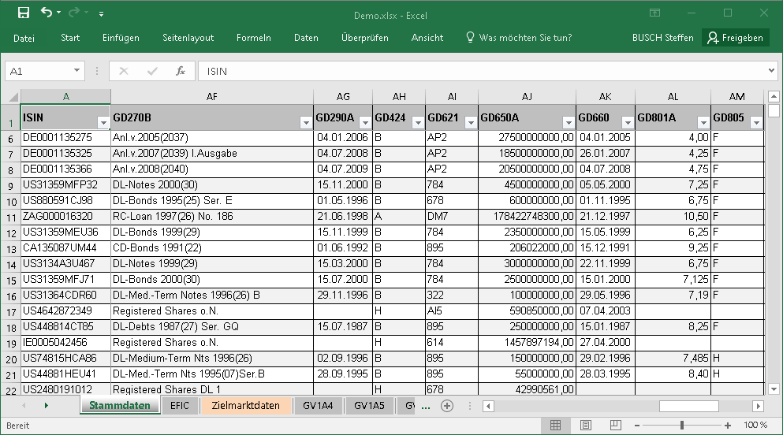
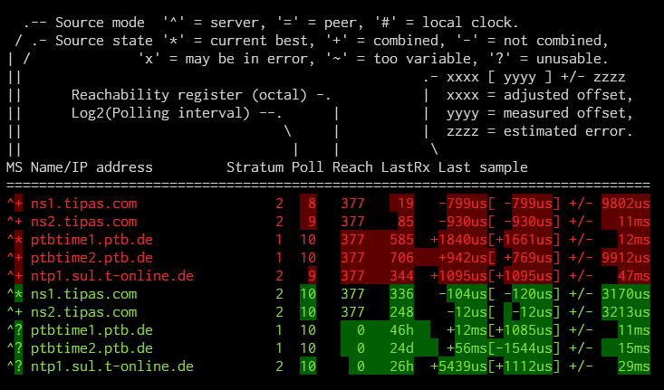

# WMACCESS Open-Source Support Initiative 2023

In continuation of our ongoing commitment to the open-source community, the [WMACCESS](https://www.wmaccess.com/en/) Team of [CPB Software (Germany) GmbH](https://www.cpb-software.com/en/) is thrilled to announce our focus for 2023: **Modern Command Line Tools**! 🛠️

Modern Command Line Tools are the lifeblood of development and system administration. They are essential for productivity, automation, and seamless operations. For 2023, we have decided to concentrate our support on projects that are bringing innovation and ease to Linux environments.

## Table of Contents

- [Aristocratos and the fabulous btop](#aristocratos-and-the-fabulous-btop)
- [John McNamara with his awesome Excel Writer tools](#john-mcnamara-with-his-awesome-excel-writer-tools)
- [tmux](#tmux)
- [Dalance with procs](#dalance-with-procs)
- [Sharkdp for bat, fd and hexyl](#sharkdp-for-bat-fd-and-hexyl)
- [Junegunn for fzf](#junegunn-for-fzf)
- [Dandavison for delta](#dandavison-for-delta)
- [acme.sh](#acmesh)
- [Caddy](#caddy)
- [jqnatividad with qsv](#jqnatividad-with-qsv)
- [solidiquis for erdtree](#solidiquis-for-erdtree)
- [GoAccess](#goaccess)
- [Continuation of open-source support](#continuation-of-open-source-support)
- [A call to action](#a-call-to-action)

## Aristocratos and the fabulous btop

We are incredibly excited to support Jakob P. Liljenberg ([Aristocratos](https://github.com/aristocratos)) for his amazing contribution to the community with [btop](https://github.com/aristocratos/btop).

`Btop` is a resource monitor that shows usage and stats for the processor, memory, disks, network and processes. We chose to support Aristocratos because `btop` stands out in its performance, feature set, and user-friendliness. We would like to extend our heartfelt gratitude to Aristocratos for developing and maintaining btop. Your hard work is making a difference in the community.

Steffen Busch - WMACCESS Product Manager:
> I'm so excited about `btop` and I have tried many tools in that category, but `btop` is simply outstanding awesome. I run it 24/7 in a separate tmux window on all of my servers. No other tool shows so much information in such a distinguishable way, but still perfect to keep an eye on CPU, I/O, RAM and network traffic. It's indispensable when conducting load tests.

We highly recommend `btop` to anyone in need of a streamlined and robust system monitoring tool. Keep the innovation coming! 🚀

## John McNamara with his awesome Excel Writer tools

We want to express our profound appreciation to [John McNamara](https://github.com/jmcnamara) for the invaluable [Excel Writer](https://github.com/jmcnamara?tab=repositories) tools in various programming languages.

WMACCESS uses the Excel Writer to generate the most beautiful and user-friendly Excel-Files, directly from our WMACCESS Database. These reports are sent to our customers.

John McNamara's dedication to maintaining and improving these tools is commendable. The WMACCESS team would like to extend a huge thank you to John for his contribution to the open-source community and the impact it has had on our services. We wholeheartedly recommend the Excel Writer tools to any team that requires advanced Excel capabilities in their workflow. Keep up the excellent work! 👏

## tmux

We'd like to extend our gratitude to the brilliant team behind [tmux](https://github.com/tmux/tmux/wiki).

`tmux`, a terminal multiplexer, revolutionizes our work by allowing us to easily switch between various programs within a single terminal. It also grants us the capability to detach these programs (keeping them running in the background) and reattach them to a different terminal, boosting our workflow efficiency significantly.

Our sincere thanks to the `tmux` team for providing this powerful tool to the open-source community. Keep up the excellent work!

## Dalance with procs

A round of applause to [@Dalance](https://github.com/dalance) for creating [procs](https://github.com/dalance/procs), a fantastic `ps` replacement built with Rust.

`Procs` is not just an alternative; it's an upgrade. With its modern, colourful output, it provides a more user-friendly experience. Its performance-enhanced features enable us to efficiently monitor our SSH-Tunnels, Application Server, and other processes.

Steffen Busch - WMACCESS Product Manager:
> I love the ability to add additional columns on demand to the output of `procs` with `--insert TcpPort` or `--insert ElapsedTime` for example. BTW, neither of these columns are supported with the traditional `ps`, but these can be very useful.

We have found `procs` to be an essential part of our day-to-day operations, and we highly recommend it to those who wish to boost their system administration productivity. Thank you, Dalance, for your innovative contribution to the community!

## Sharkdp for bat, fd, and hexyl

A massive thank you to David Peter, aka [@sharkdp](https://github.com/sharkdp), for his many CLI tools such as, but not limited to, [bat](https://github.com/sharkdp/bat), [fd](https://github.com/sharkdp/fd) and [hexyl](https://github.com/sharkdp/hexyl).

Each tool provides unique, user-friendly enhancements to classic Unix commands, transforming our day-to-day operations. `bat` is a `cat(1)` clone with wings, `fd` is a simpler and faster alternative to `find`, and `hexyl` is a user-friendly command-line hex viewer, incredibly useful for analysing low digits in files.

David, your contributions have made our workdays smoother, more productive and colorful. For that, we can't thank you enough!

## Junegunn for fzf

We are grateful to Junegunn Choi, aka [@junegunn](https://github.com/junegunn), for creating [fzf](https://github.com/junegunn/fzf), a powerful, versatile command-line fuzzy finder.

`fzf` has bumped the efficiency of how we interact with the shell. It offers a unique approach to command-line interfaces, turning them into powerful interactive experiences. With its capability to work with any list and provide flexible layouts, `fzf` has quickly become one of our most valued tools. Thanks, Junegunn, for this wonderful contribution!

## Dandavison for delta

Our heartfelt thanks to [Dan Davison](https://github.com/dandavison) for [delta](https://github.com/dandavison/delta), a syntax-highlighting pager for git, diff, and grep output.

`Delta` has become an indispensable tool for our team, particularly for file comparison tasks using diff or comparing command output from our primary and fallback server. Dan, your tool has significantly improved our workflow. We can't express enough how much we appreciate your hard work and contribution!

## acme.sh 

Our sincere appreciation goes to [Neil Pang](https://github.com/Neilpang), creator of [acme.sh](https://github.com/acmesh-official/acme.sh). This tool is more than just a shell script for [Let's Encrypt](https://letsencrypt.org/) certificate management; it's a one-stop solution for SSL management needs, supporting numerous platforms and DNS APIs.

In today's security-focused digital environment, having a robust, flexible, and easy-to-use SSL management tool like `acme.sh` is essential. Thank you Neil and the acme.sh team, for providing this must-have resource! 🛡️

## Caddy

Big appreciation for [Caddy](https://github.com/caddyserver/caddy), a swift, extensible multi-platform HTTP/1-2-3 web server with automatic HTTPS, elegantly crafted in Go ensuring memory safety. 🛡️🔒

Steffen Busch - WMACCESS Product Manager:
> We're thrilled about integrating Caddy into our production environment in the upcoming months. The excellent, up-to-date documentation has been a valuable resource in our preparation.

We're continuously sponsoring the Caddy project, expressing our gratitude and support towards the Caddy community and maintainers for delivering a top-notch web server. This web server is not just a tool; it's a valuable asset in our tech stack, promising a secure, efficient web serving experience. A massive thank you to the Caddy community for this outstanding open-source contribution! 🙏

## jqnatividad with qsv

A huge shoutout to Joel Natividad, aka [@jqnatividad](https://github.com/jqnatividad), for developing [qsv](https://github.com/jqnatividad/qsv), an exceptional tool for managing CSV files with ease and efficiency.

`qsv` is more than just a CSV handler; it's a robust toolkit. Its capability of slicing 🔪, dicing, and analyzing 📊 CSV files makes it an indispensable tool for anyone dealing with large data sets in CSV format.

We have integrated `qsv` into our workflow and it has remarkably improved our CSV data feed generation testing. A big thank you to Joel for this invaluable contribution to the open-source community!

## solidiquis for erdtree

Kudos to Benji Nguyen, aka [@solidiquis](https://github.com/solidiquis), for crafting [erdtree](https://github.com/solidiquis/erdtree), a modern, cross-platform, and multi-threaded filesystem and disk-usage utility, which operates under the command `erd`.

`erd` is not merely a disk-usage utility; it's a visual delight. With its colorful 🎨, beautiful 🖼️ output, understanding disk usage has never been more enjoyable. 🎉

Steffen Busch - WMACCESS Product Manager:
> I've found `erd` to be a stellar replacement for the traditional `tree` command. My alias `TREE="erd --human --long --level 1 --icons --hidden --sort name"` has become a daily driver in my workflow, offering a much more engaging and informative view of our filesystem. The colorful and aesthetic output makes disk analysis not just insightful, but also visually pleasing.

We wholeheartedly recommend `erd` to those aiming to add a splash of color to their disk analysis endeavors. A colossal thank you to Benji for this vibrant and invaluable addition to the open-source sphere!

## GoAccess

A big salute to Gerardo O., aka [@allinurl](https://github.com/allinurl), for developing [GoAccess](https://github.com/allinurl/goaccess), a real-time web log analyzer 📊🔍 and interactive viewer that operates effortlessly in a terminal on *nix systems or through your web browser.

Steffen Busch - WMACCESS Product Manager:
> I am particularly enamored with the real-time HTML interface of GoAccess. It not only allows for immediate analysis and visualization of web logs, but also provides an intuitive, easy-to-navigate user experience.

We're excited about the potential of GoAccess to enhance our web log analysis efforts further. Its seamless integration with Caddy, as seen in [this GitHub issue](https://github.com/allinurl/goaccess/issues/2564) where Gerardo provided prompt support, demonstrates the active and responsive community behind GoAccess. A huge thank you to Gerardo for this substantial open-source contribution! 🙌💻

## Continuation of open-source support

We will continue to actively support incredible open-source projects in the following years. We believe in the sustainability, growth, and innovative potential of open source, and will remain dedicated contributors to this invaluable ecosystem.

## A call to action

The open-source community thrives on the collective contributions of individuals and organizations. As the digital world continues to evolve, let us ensure that the foundations remain strong and innovative through our support.

We call upon companies and individuals to join us in this mission. Whether it is contributing code, reporting bugs, spreading the word, or providing financial support, every action counts.

Let’s celebrate and uplift the spirits of those who dedicate themselves to open source. Together, we can ensure that this remarkable community continues to flourish, innovate, and inspire generations to come.

_Thank you for being a part of this journey!_ 🚀

_The WMACCESS Team_
